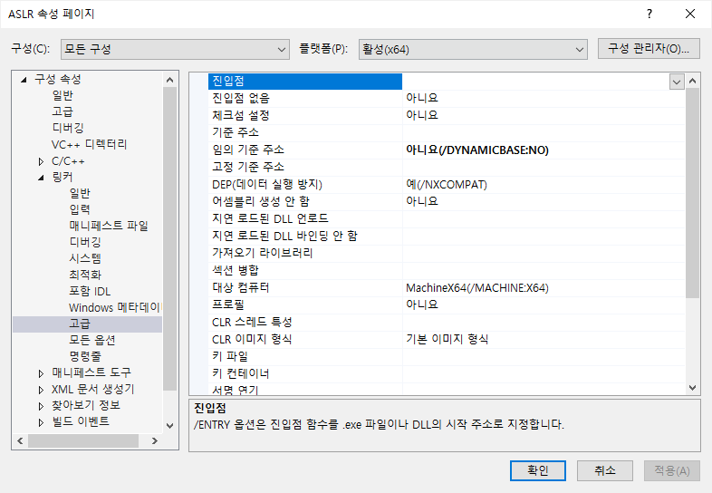
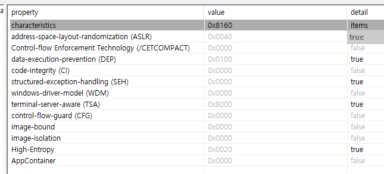
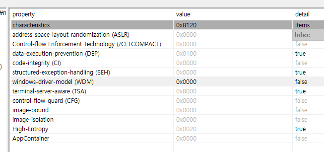
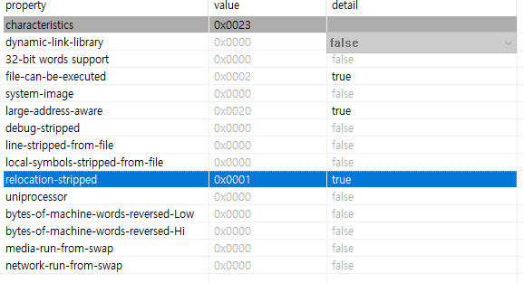
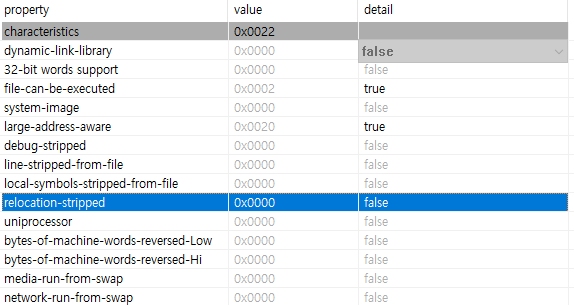
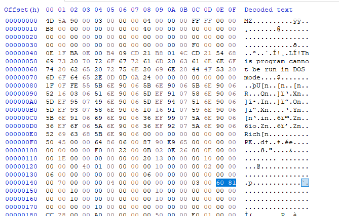
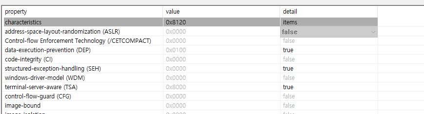
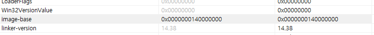
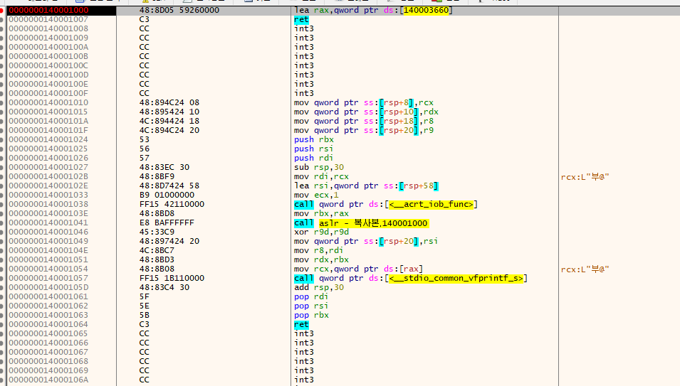

# ASLR
## 개요
* 제작일 : 2024-03-07
* 개발도구 : Visual Studio 2022
* 분석도구 : PEStudio 9.58, HXD, x64dbg
* OS : Window10

## 내용
### ASLR(Address Space Layout Randomization)
    Window Kernel 6 버전 이후부터 적용된 기능.
    PE 파일이 Image로 올라갔을 때, ImageBase + 섹션 계산을 막기 위해 랜덤 주소로
    올리는 기능이다. (보안상 목적)

### Visual studio 에서 기능 적용

<strong><u>속성-링커-고급-임의 기준 주소</strong></u>  
기본 값: DYNAMICBASE (ASLR 기능이 기본적으로 켜져있다.)

### PESTUDIO 분석
#### ASLR.exe

#### NoASLR.exe

<strong><U>Image NT Header - Image Optional Header - Characteristics</U></strong>  
값의 ASLR (0x40) 플래그가 켜져있음을 확인할 수 있다.

#### ASLR.exe

#### NoASLR.exe

<strong><U>Image NT Header - Image File Header - Characteristics</U></strong>  
값의 ASLR (0x001) 플래그가 켜져있음을 확인할 수 있다.

### ASLR 기능 강제로 끄기
  
    HxD를 이용하여, ASLR 켜져 있는 프로그램에 <strong><U>Image_File_Header - characteristcis</U></strong> 위치 값에서 ASLR 플래그 (0x40)을 바꿔(8160 -> 8120)준다. 

### 검증

#### PEstudio

ASLR 기능이 꺼져있음을 확인할 수 있다.

  
ImageBase 140000000 이다. 그렇다면 140001000 .text 섹션의 시작 위치일 것이다.

#### x64dbg

.text 시작 위치임을 확인할 수 있다.